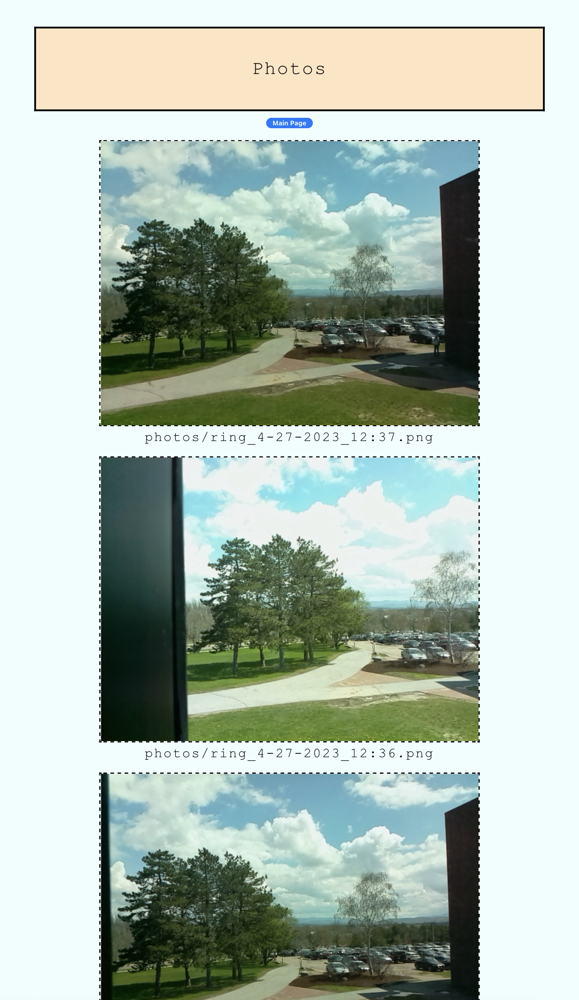

# Dorm-Defender
The dorm defender is an apartment security camera with doorbell functionalilty. It runs on a flask server where live video can be seen anytime the device is powered on. The device is equiped with a doorbell button, PIR motion sensor, and a live camera. It can also be connected to a bluetooth speaker so that doorbell rings can be heard.
# Device
Below is the device along with the planned housing model: 

 
# Text Notifications
The device relies on text notifications to alert users of motion and rings (can be specified in the settings). Below are examples of some text alerts: 
 

# Website photos
Below are example photos of different pages on different devices: 

 

 

 
